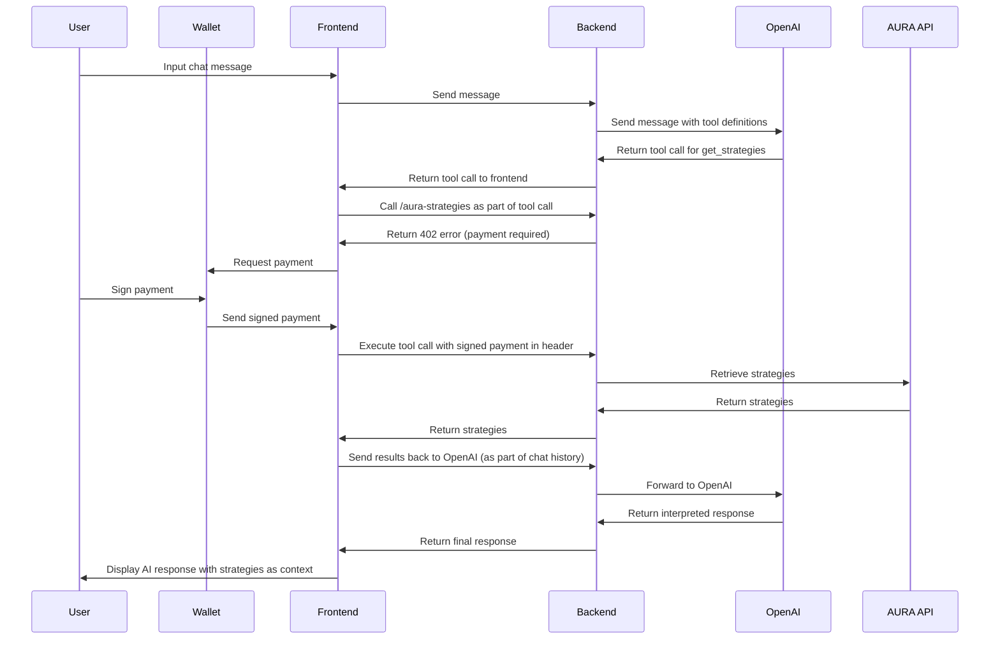

# HeyAura - AI-Powered DeFi Strategy Assistant

HeyAura is a demonstration application showcasing the power of the AURA API and x402 micropayments. This AI-powered DeFi assistant connects to the AURA framework to analyze wallet portfolios and provide personalized strategy recommendations through natural conversation, charging users a tiny amount for each request.

> Note: this is a hackathon demo — not production-ready. Additional work would be needed before turning this into a production application: security hardening, tests, monitoring etc. In its current state the app is only intended for showcasing the AURA API combined with an LLM chat and x402 payments.

> This is not an official AURA project nor is it endorsed by the AdEx or AURA team.


### Chat UI


| 
|-

| 
|-

| 
|-

| 
|-


## Architecture Overview

HeyAura is built as a full-stack application with a React frontend and an Express.js backend

### React client

This is where most of the magic happens: the chat history storage & management, LLM tool calling logic, wallets management, the payments themselves occur here etc.

### Express server

This is a stateless application that proxies requests from the frontend to the third parties, adding protection on top like rate limiting for OpenAI requests and x402 payments for the AURA API requests.


```
┌──────────────────────┐     ┌────────────────────┐     ┌───────────────────────────────────┐
│    React Client      │     │  Express Server    │     │      External APIs                │
│                      │     │                    │     │                                   │
│ • Chat interface     │<───>│ • OpenAI proxy     │<───>│ • OpenAI API                      │
│ • Wallet management  │     │ • x402 protection  │     │ • AURA API                        │
│ • Payment UI         │     │ • AURA proxy       │     │ • Coinbase CDP (x402 verification)│
└──────────────────────┘     └────────────────────┘     └───────────────────────────────────┘
```

## 🔧 How LLM Tool Calling Works

(for context on function/tool calling see: https://platform.openai.com/docs/guides/function-calling )

The application implements a special pattern for LLM tool calling that enables the AI to execute paid API calls while handling micropayments client-side, without having to have the server manage private keys or keep a balance.
It works by having the actual function calling happen client side, with all requests to the LLM and other third parties proxied through the server:

### 1. **Frontend-Backend Proxy Pattern**

The system uses a proxy pattern where:
- The **frontend** maintains the "state" (chat history) for the chat and decides when to interact with the LLM (via the backend, which proxies the LLM requests)
- The **backend** receives LLM messages, including tool calls, from OpenAI, and sends these back to the frontend to deal with
- The **frontend** executes the actual tool calls by making requests to the backend -- so far the only tool call is `get_strategies` which calls the AURA API
- The **backend** receives requests from the frontend as part of the tool call and will return a `402` error if payment is required, as per the x402 protocol
- The **frontend** intercepts 402 payment responses and handles payment using the user's crypto wallet, then resubmits the requests to the backend
- The **backend** receives the request with the payment header, verifies the payment, then retrieves the data from the external API and returns it to the frontend, which appends the tool call to the chat history for the rest of the conversation with the LLM

This disagram illustrates the flow when the user interacts with the chat and the chat decides it should call get_strategies to get the AURA strategies:




## Development


### Environment variables

These are the env vars you need to provide regardless of how you run the application. The only one that requires payment is OPENAI_API_KEY, which charges for the LLM usage.

- **OPENAI_API_KEY** : OpenAI API key, with permission to create chat completions. See https://platform.openai.com/api-keys
- **CDP_API_KEY_ID** : API key for Coinbase CDP, for verifying the x402 payments on Base. Get your key and secret for free from https://portal.cdp.coinbase.com/
- **CDP_API_KEY_SECRET** : See CDP_API_KEY_ID
- **PAYTO_ADDRESS** : EVM address that will receive the x402 payments
- **AURA_API_KEY** (Optional) : API key for AURA API. WIthout this, rate limits are quite strict but the application will still work


### Recommended: Run with Docker Compose (dev)

Docker is the easiest way to run the full stack consistently. You should only need to have Docker installed. A docker compose file is provided, though there is only one container so running with just `docker` would be trivial too.

```bash
# Create and populate .env
cp .env.example .env

# Start the container
docker-compose up --build

# App will be available at http://localhost:5000
```

Hot-reload is enabled via with the volumes mounted, for a fast feedback loop.

### Alternative: Run locally with Node.js (dev)

If you prefer not to use Docker, you can wun directly on your host machine:

#### Prerequisites

- Node.js 22+ (lower probably works, but untested)
- npm or yarn


```bash
npm install

# Create and populate .env
cp .env.example .env

# Start dev server
npm run dev

# App available at http://localhost:5000
```

### Production Deployment

The app is not yet production ready, but the easiest way to deploy would be using the Docker image. It may also be recommended to better split apart the frontend and backend, and serve them separately.
To build the application (frontend and backend), `npm run build` will work.

## Usage

1. **Connect Your Wallet**: Click the wallet button to connect your browser wallet (only Metamask and Rabby on a desktop have been tested)
2. **Start Chatting**: Ask the AI about DeFi strategies
3. **Get Personalized Analysis**: When you ask for strategy analysis, the AI will request payment confirmation - it should ask you to confirm before trying to do this for the first time
4. **Approve Payments**: Use your connected wallet to approve micropayments for API calls
5. **Receive Recommendations**: Get personalized DeFi strategy recommendations based on your portfolio

## Potential roadmap & future enhancements

I limited the scope of the project for the sake of completion before the hackathon, but here are some other ideas I'd have liked to explore. Most of them would be fairly trivial to implement since I had a few of these in mind while architecting the app. 

- **Built-in wallet auto-pay with top-ups**: I started on this by having the app generate a built-in wallet (it has the private key stored in localstorage), but it would be nice to flesh out the built-in wallet to support topping it up easily + automatically taking micropayments from this wallet without user prompts. For the sake of transparency in the demo, prompting the user for payment is actually quite useful, but in real life use this creates some friction so being able to use a "hot wallet" with topups, spending limits etc. could enable frictionless auto-payments while allowing the user to control their wallet fully.
- **Charge x402 for LLM requests**: In addition to charging for AURA data fetches, meter and charge chat completion/tool-call tokens using x402. This would allow the app to cover the costs of using the LLM, and in general might be a good use case for x402 with any LLM-enabled application.
- **MCP server support/additional functionality**: Add some MCP endpoints (or potentially even allow users to provide them, with some protections on top) that the LLM could call alongside AURA, making the chat more useful. This demo focuses on the AURA + x402 functionality, but it could provide more useful commentary on top.
- **Streaming messages**: Minor, but would be nice to stream the LLM responses instead of waiting for the full response before rendering. It may make the server proxy a bit more complex but would improve UX/perceived response times.


These would be required before going to production:

- **Observability & auditability**: Add structured logs, trace IDs, and user-viewable payment receipts per request; export signed receipts for third-party verification.
- **Resilience & retries**: Exponential backoff and circuit breakers for upstreams (OpenAI, AURA), plus graceful degradation and cached fallbacks.
- **Additional security hardening**: We already have basic rate limiting (in-memory on the chat completions requests), but this should be improved, plus a more thorough security review should be done. 


## Useful links

- [AURA API Documentation](https://aura.adex.network)
- [x402 Protocol Documentation](https://github.com/coinbase/x402)
- [OpenAI function calling](https://platform.openai.com/docs/guides/function-calling)

